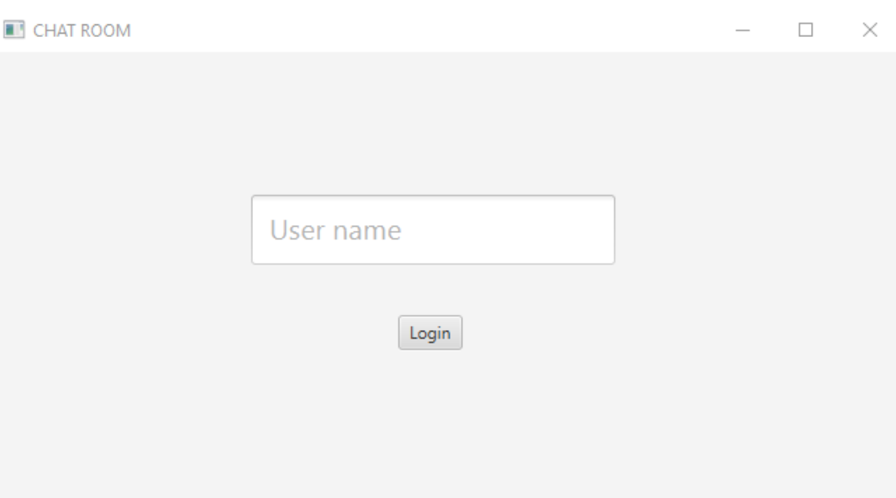
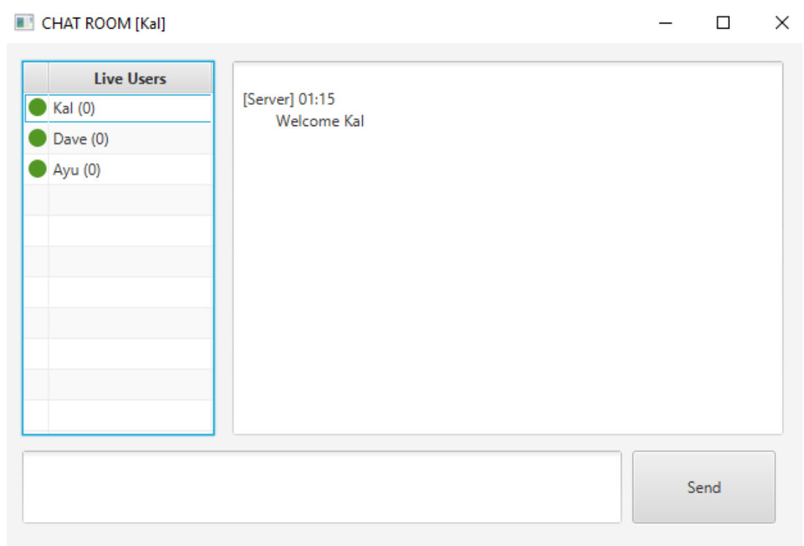

# Chat Room Application with Java RMI

## Introduction

Chat rooms are online spaces where users communicate with one another through text-based messages. It's like a virtual cocktail party, where strangers gather to discuss politics and sports, ask for advice, talk about shared hobbies and interests, or simply hang out. Chat rooms were the original social network and have played an important role in the evolution of interpersonal communication over computer networks.

In this project, we implement a chat room based on Java RMI and distributed system concepts. This document aims to showcase the features of our application, the methodology with which we built them, and limitations of the project.

## System Overview

Our application has two versions, a GUI interface using JavaFX and a CLI version. The server is designed to run on the terminal, and both versions of the app can communicate with it. We kept the CLI interface because it is much easier to debug and clearly shows the distributed concepts implemented. The client interfaces get the server stub from the registry and communicate via multicasts (serial message broadcasts in implementation). Vector clocks are used to maintain causal order of messages. The server maintains a log of all messages which serves as a history.

First time the application is run it will look for the server. Failing to find it the application will start a server. If it locates the server it will display the above window which prompts the user for a username. On login, it will make a request to the server to see if the username is already taken and if not it will register itself with the new username.

## User Interface

Once registered, the user interface will change. It will show a message area where messages will be displayed along with sender and time, a send area where new messages can be written, a button to send the new message, and a table displaying the users in the chatroom.

The dot next to the name of the user changes when the user broadcasts a message. If it can't access the `addMessage` function of the user, the dot will become red. The numbers next to the names are the vector clock values associated with the specific users. If a user joins late in the conversation, there is an `initVectorClock` function that the server runs to initialize the client's vector clock values.

## Graceful Exit

We have implemented a 'graceful exit', meaning that if a client falls out of contact without deregistering itself, an error should not occur. When a user exits, there is a shutdown hook that deregisters the client from the server. If a user is out of connection for a while and receives a late message, it uses vector clocks embedded in the message to decide whether it should show it or delay. If the number of messages in the wait queue reaches a certain threshold, it will request history from the server and synchronize itself.

## Limitations

As this project is intended as a means of practicing the concepts of distributed systems, security issues have not been taken into consideration. Also, it suffers single-node failure if that node is the server. If there is a future version, it will be built so that any peer can have server capabilities.

## Screenshots

 

## License

This project is licensed under the MIT License - see the [LICENSE](LICENSE) file for details.
